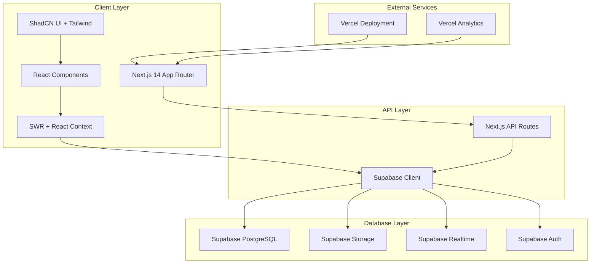
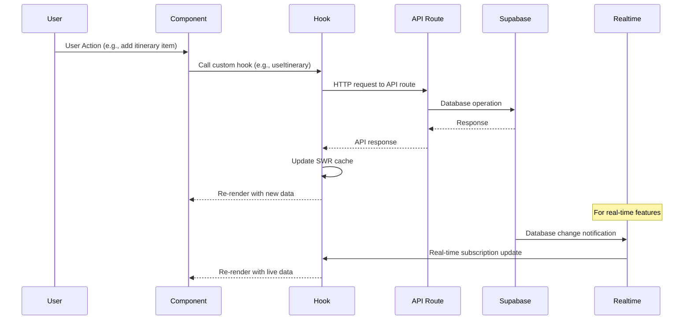
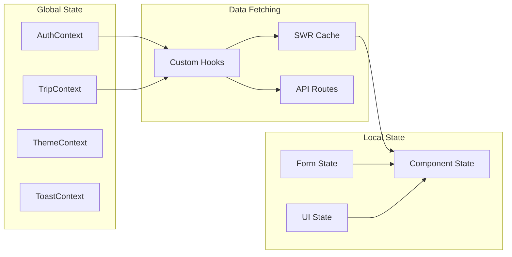
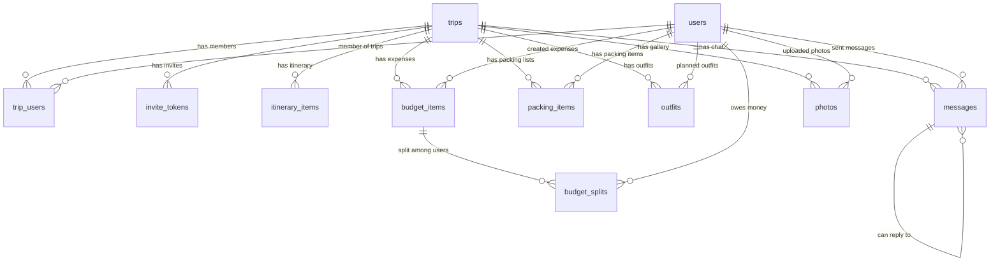
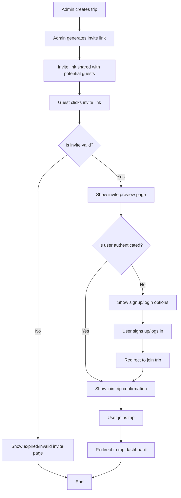

# TripTogether - Architecture Reference Document

A comprehensive reference for the collaborative trip planning web application built with Next.js 14, Supabase, and Tailwind CSS.

## Table of Contents

1. [File & Folder Structure](#file--folder-structure)
2. [System Architecture](#system-architecture)
3. [Database Schema](#database-schema)
4. [Environment Setup](#environment-setup)
5. [Authentication Flow](#authentication-flow)
6. [Deployment & CI/CD Pipeline](#deployment--cicd-pipeline)
7. [End-to-End Testing](#end-to-end-testing)

---

## File & Folder Structure

### Complete Directory Tree

```
triptogether/
├── .env.local                          # Environment variables (local development)
├── .env.example                        # Environment variables template
├── .gitignore                          # Git ignore rules
├── next.config.js                      # Next.js configuration
├── package.json                        # Dependencies and scripts
├── tailwind.config.js                  # Tailwind CSS configuration
├── tsconfig.json                       # TypeScript configuration
├── playwright.config.ts                # Playwright testing configuration
├── components.json                     # ShadCN UI configuration
├── README.md                           # Project documentation
├── architecture.md                     # This architecture document
│
├── src/
│   ├── app/                           # Next.js 14 App Router
│   │   ├── globals.css                # Global styles and Tailwind imports
│   │   ├── layout.tsx                 # Root layout component
│   │   ├── page.tsx                   # Home page (landing/marketing)
│   │   ├── loading.tsx                # Global loading UI
│   │   ├── error.tsx                  # Global error UI
│   │   ├── not-found.tsx              # 404 page
│   │   │
│   │   ├── (auth)/                    # Auth route group
│   │   │   ├── login/
│   │   │   │   └── page.tsx           # Login page
│   │   │   ├── signup/
│   │   │   │   └── page.tsx           # Signup page
│   │   │   └── layout.tsx             # Auth layout (centered forms)
│   │   │
│   │   ├── (dashboard)/               # Protected dashboard routes
│   │   │   ├── dashboard/
│   │   │   │   ├── page.tsx           # Main dashboard
│   │   │   │   ├── loading.tsx        # Dashboard loading state
│   │   │   │   └── error.tsx          # Dashboard error boundary
│   │   │   ├── trips/
│   │   │   │   ├── page.tsx           # Trip list/selection
│   │   │   │   └── [tripId]/
│   │   │   │       ├── page.tsx       # Trip dashboard
│   │   │   │       ├── itinerary/
│   │   │   │       │   └── page.tsx   # Itinerary management
│   │   │   │       ├── budget/
│   │   │   │       │   └── page.tsx   # Budget tracker
│   │   │   │       ├── packing/
│   │   │   │       │   └── page.tsx   # Packing list
│   │   │   │       ├── outfits/
│   │   │   │       │   └── page.tsx   # Outfit planner
│   │   │   │       ├── chat/
│   │   │   │       │   └── page.tsx   # Real-time chat
│   │   │   │       ├── gallery/
│   │   │   │       │   └── page.tsx   # Photo gallery
│   │   │   │       └── settings/
│   │   │   │           └── page.tsx   # Trip settings (admin only)
│   │   │   └── layout.tsx             # Dashboard layout with navigation
│   │   │
│   │   ├── invite/
│   │   │   └── [token]/
│   │   │       ├── preview/
│   │   │       │   └── page.tsx       # Invite preview (public)
│   │   │       └── join/
│   │   │           └── page.tsx       # Join trip after auth
│   │   │
│   │   └── api/                       # API routes
│   │       ├── auth/
│   │       │   ├── callback/
│   │       │   │   └── route.ts       # Supabase auth callback
│   │       │   └── signout/
│   │       │       └── route.ts       # Sign out endpoint
│   │       ├── trips/
│   │       │   ├── route.ts           # GET /api/trips, POST /api/trips
│   │       │   └── [tripId]/
│   │       │       ├── route.ts       # GET, PUT, DELETE /api/trips/[tripId]
│   │       │       ├── invite/
│   │       │       │   └── route.ts   # POST /api/trips/[tripId]/invite
│   │       │       ├── itinerary/
│   │       │       │   └── route.ts   # CRUD itinerary items
│   │       │       ├── budget/
│   │       │       │   └── route.ts   # CRUD budget items
│   │       │       ├── packing/
│   │       │       │   └── route.ts   # CRUD packing items
│   │       │       ├── outfits/
│   │       │       │   └── route.ts   # CRUD outfit items
│   │       │       ├── messages/
│   │       │       │   └── route.ts   # CRUD chat messages
│   │       │       └── photos/
│   │       │           └── route.ts   # CRUD photo gallery
│   │       ├── invite/
│   │       │   └── [token]/
│   │       │       └── route.ts       # GET invite details, POST join trip
│   │       └── upload/
│   │           └── route.ts           # File upload handling
│   │
│   ├── components/                    # Reusable UI components
│   │   ├── ui/                        # ShadCN UI components
│   │   │   ├── button.tsx
│   │   │   ├── input.tsx
│   │   │   ├── card.tsx
│   │   │   ├── dialog.tsx
│   │   │   ├── dropdown-menu.tsx
│   │   │   ├── form.tsx
│   │   │   ├── toast.tsx
│   │   │   ├── avatar.tsx
│   │   │   ├── badge.tsx
│   │   │   ├── calendar.tsx
│   │   │   ├── checkbox.tsx
│   │   │   ├── progress.tsx
│   │   │   ├── select.tsx
│   │   │   ├── sheet.tsx
│   │   │   ├── tabs.tsx
│   │   │   └── textarea.tsx
│   │   │
│   │   ├── auth/                      # Authentication components
│   │   │   ├── LoginForm.tsx
│   │   │   ├── SignupForm.tsx
│   │   │   ├── AuthProvider.tsx       # Auth context provider
│   │   │   └── ProtectedRoute.tsx     # Route protection HOC
│   │   │
│   │   ├── dashboard/                 # Dashboard-specific components
│   │   │   ├── DashboardNav.tsx       # Main navigation
│   │   │   ├── TripCard.tsx           # Trip overview card
│   │   │   ├── RSVPStatus.tsx         # RSVP status indicator
│   │   │   ├── BudgetSummary.tsx      # Budget overview widget
│   │   │   ├── PackingProgress.tsx    # Packing list progress
│   │   │   └── UpcomingEvents.tsx     # Next events widget
│   │   │
│   │   ├── trip/                      # Trip-specific components
│   │   │   ├── TripHeader.tsx         # Trip title and basic info
│   │   │   ├── MembersList.tsx        # Trip participants
│   │   │   ├── InviteLink.tsx         # Generate/share invite links
│   │   │   └── RoleIndicator.tsx      # Admin/guest role display
│   │   │
│   │   ├── itinerary/                 # Itinerary components
│   │   │   ├── ItineraryList.tsx      # List of itinerary items
│   │   │   ├── ItineraryItem.tsx      # Single itinerary item
│   │   │   ├── AddItineraryItem.tsx   # Add new item form
│   │   │   └── EditItineraryItem.tsx  # Edit item modal
│   │   │
│   │   ├── budget/                    # Budget components
│   │   │   ├── BudgetTracker.tsx      # Main budget interface
│   │   │   ├── BudgetItem.tsx         # Individual budget item
│   │   │   ├── AddExpense.tsx         # Add expense form
│   │   │   ├── ExpenseSplit.tsx       # Split expense calculator
│   │   │   └── PaymentStatus.tsx      # Payment tracking
│   │   │
│   │   ├── packing/                   # Packing list components
│   │   │   ├── PackingList.tsx        # Main packing interface
│   │   │   ├── PackingItem.tsx        # Individual packing item
│   │   │   ├── AddPackingItem.tsx     # Add item form
│   │   │   ├── PackingCategories.tsx  # Category organization
│   │   │   └── PackingProgress.tsx    # Progress indicator
│   │   │
│   │   ├── outfits/                   # Outfit planner components
│   │   │   ├── OutfitPlanner.tsx      # Main outfit interface
│   │   │   ├── OutfitCard.tsx         # Individual outfit display
│   │   │   ├── AddOutfit.tsx          # Add outfit form
│   │   │   ├── OutfitCalendar.tsx     # Calendar view of outfits
│   │   │   └── WeatherIntegration.tsx # Weather-based suggestions
│   │   │
│   │   ├── chat/                      # Real-time chat components
│   │   │   ├── ChatRoom.tsx           # Main chat interface
│   │   │   ├── MessageList.tsx        # Message history
│   │   │   ├── MessageInput.tsx       # Message composition
│   │   │   ├── Message.tsx            # Individual message
│   │   │   └── OnlineUsers.tsx        # Active users indicator
│   │   │
│   │   ├── gallery/                   # Photo gallery components
│   │   │   ├── PhotoGallery.tsx       # Main gallery interface
│   │   │   ├── PhotoGrid.tsx          # Grid layout of photos
│   │   │   ├── PhotoUpload.tsx        # Upload interface
│   │   │   ├── PhotoModal.tsx         # Full-size photo viewer
│   │   │   └── PhotoAlbums.tsx        # Album organization
│   │   │
│   │   ├── invite/                    # Invite system components
│   │   │   ├── InvitePreview.tsx      # Public invite preview
│   │   │   ├── InviteForm.tsx         # Join trip form
│   │   │   └── InviteExpired.tsx      # Expired invite message
│   │   │
│   │   └── common/                    # Common utility components
│   │       ├── LoadingSpinner.tsx     # Loading states
│   │       ├── ErrorBoundary.tsx      # Error handling
│   │       ├── ConfirmDialog.tsx      # Confirmation modals
│   │       ├── DatePicker.tsx         # Date selection
│   │       ├── ImageUpload.tsx        # Image upload widget
│   │       ├── SearchInput.tsx        # Search functionality
│   │       └── EmptyState.tsx         # Empty state messages
│   │
│   ├── lib/                           # Utility libraries and configurations
│   │   ├── supabase/                  # Supabase configuration
│   │   │   ├── client.ts              # Client-side Supabase client
│   │   │   ├── server.ts              # Server-side Supabase client
│   │   │   ├── middleware.ts          # Auth middleware
│   │   │   └── types.ts               # Database type definitions
│   │   │
│   │   ├── auth/                      # Authentication utilities
│   │   │   ├── config.ts              # Auth configuration
│   │   │   ├── helpers.ts             # Auth helper functions
│   │   │   └── types.ts               # Auth type definitions
│   │   │
│   │   ├── api/                       # API utilities
│   │   │   ├── client.ts              # API client configuration
│   │   │   ├── endpoints.ts           # API endpoint definitions
│   │   │   ├── types.ts               # API type definitions
│   │   │   └── errors.ts              # Error handling utilities
│   │   │
│   │   ├── hooks/                     # Custom React hooks
│   │   │   ├── useAuth.ts             # Authentication hook
│   │   │   ├── useTrip.ts             # Trip data hook
│   │   │   ├── useItinerary.ts        # Itinerary management hook
│   │   │   ├── useBudget.ts           # Budget tracking hook
│   │   │   ├── usePacking.ts          # Packing list hook
│   │   │   ├── useOutfits.ts          # Outfit planner hook
│   │   │   ├── useChat.ts             # Real-time chat hook
│   │   │   ├── useGallery.ts          # Photo gallery hook
│   │   │   ├── useInvite.ts           # Invite system hook
│   │   │   ├── useRealtime.ts         # Supabase realtime hook
│   │   │   └── useLocalStorage.ts     # Local storage hook
│   │   │
│   │   ├── context/                   # React Context providers
│   │   │   ├── AuthContext.tsx        # Authentication context
│   │   │   ├── TripContext.tsx        # Current trip context
│   │   │   ├── ThemeContext.tsx       # Theme/UI context
│   │   │   └── ToastContext.tsx       # Toast notifications context
│   │   │
│   │   ├── utils/                     # Utility functions
│   │   │   ├── cn.ts                  # Class name utility (clsx + tailwind-merge)
│   │   │   ├── date.ts                # Date formatting utilities
│   │   │   ├── currency.ts            # Currency formatting
│   │   │   ├── validation.ts          # Form validation schemas
│   │   │   ├── permissions.ts         # Role-based permissions
│   │   │   ├── storage.ts             # File storage utilities
│   │   │   ├── constants.ts           # App constants
│   │   │   └── helpers.ts             # General helper functions
│   │   │
│   │   └── types/                     # TypeScript type definitions
│   │       ├── database.ts            # Database schema types
│   │       ├── auth.ts                # Authentication types
│   │       ├── trip.ts                # Trip-related types
│   │       ├── api.ts                 # API response types
│   │       └── global.ts              # Global type definitions
│   │
│   └── styles/                        # Additional styling
│       ├── globals.css                # Global CSS and Tailwind imports
│       └── components.css             # Component-specific styles
│
├── public/                            # Static assets
│   ├── favicon.ico
│   ├── logo.svg
│   ├── images/
│   │   ├── hero-bg.jpg
│   │   ├── default-avatar.png
│   │   └── trip-placeholder.jpg
│   └── icons/
│       ├── apple-touch-icon.png
│       └── manifest.json
│
├── tests/                             # Testing files
│   ├── playwright/                    # E2E tests
│   │   ├── auth/
│   │   │   ├── login.spec.ts
│   │   │   ├── signup.spec.ts
│   │   │   └── invite-flow.spec.ts
│   │   ├── dashboard/
│   │   │   ├── trip-creation.spec.ts
│   │   │   ├── navigation.spec.ts
│   │   │   └── responsive.spec.ts
│   │   ├── trip/
│   │   │   ├── itinerary.spec.ts
│   │   │   ├── budget.spec.ts
│   │   │   ├── packing.spec.ts
│   │   │   ├── outfits.spec.ts
│   │   │   ├── chat.spec.ts
│   │   │   └── gallery.spec.ts
│   │   ├── admin/
│   │   │   ├── trip-management.spec.ts
│   │   │   ├── invite-generation.spec.ts
│   │   │   └── user-management.spec.ts
│   │   ├── fixtures/
│   │   │   ├── test-data.ts
│   │   │   └── mock-users.ts
│   │   └── utils/
│   │       ├── test-helpers.ts
│   │       └── page-objects.ts
│   │
│   └── __mocks__/                     # Mock files for testing
│       ├── supabase.ts
│       └── next-router.ts
│
├── docs/                              # Additional documentation
│   ├── api.md                         # API documentation
│   ├── deployment.md                  # Deployment guide
│   ├── contributing.md                # Contribution guidelines
│   └── troubleshooting.md             # Common issues and solutions
│
└── .github/                           # GitHub configuration
    ├── workflows/
    │   ├── ci.yml                     # Continuous integration
    │   ├── deploy.yml                 # Deployment workflow
    │   └── test.yml                   # Testing workflow
    ├── ISSUE_TEMPLATE/
    │   ├── bug_report.md
    │   └── feature_request.md
    └── pull_request_template.md
```

### Naming Conventions

#### Components
- **PascalCase** for component files: `TripCard.tsx`, `BudgetTracker.tsx`
- **Descriptive names** that indicate purpose: `AddItineraryItem.tsx` vs `ItineraryForm.tsx`
- **Feature-based grouping**: Components grouped by feature area (auth/, trip/, etc.)

#### Hooks
- **camelCase** starting with "use": `useAuth.ts`, `useTrip.ts`
- **Descriptive of data/functionality**: `useRealtime.ts`, `useLocalStorage.ts`

#### Utilities
- **camelCase** for utility files: `validation.ts`, `permissions.ts`
- **Singular nouns** for utility modules: `date.ts`, `currency.ts`

#### API Routes
- **RESTful conventions**: 
  - `GET /api/trips` - List trips
  - `POST /api/trips` - Create trip
  - `GET /api/trips/[tripId]` - Get specific trip
  - `PUT /api/trips/[tripId]` - Update trip
  - `DELETE /api/trips/[tripId]` - Delete trip

#### Database Tables
- **snake_case** for table names: `trip_users`, `itinerary_items`
- **Descriptive relationships**: `trip_id`, `user_id` for foreign keys
- **Plural nouns** for collection tables: `trips`, `messages`, `photos`

### File Organization Principles

#### Pages (`src/app/`)
- **Route groups** for logical organization: `(auth)`, `(dashboard)`
- **Nested routes** follow URL structure: `/trips/[tripId]/budget`
- **Co-located** loading and error states with pages

#### Components (`src/components/`)
- **Feature-based folders**: Each major feature has its own component folder
- **ui/ folder** for reusable ShadCN components
- **common/ folder** for shared utility components

#### Library Code (`src/lib/`)
- **Separation of concerns**: auth/, api/, hooks/, context/, utils/
- **Client/server separation**: Separate Supabase clients for different environments
- **Type definitions**: Centralized in types/ folder with feature-based organization

#### Testing (`tests/`)
- **Mirror app structure**: Test organization follows app structure
- **Feature-based grouping**: Tests grouped by feature area
- **Shared utilities**: Common test helpers and fixtures

---

## System Architecture

### High-Level Architecture Overview



### Component Interaction Flow



### State Management Architecture



### API Route Structure

#### Authentication Routes
- `POST /api/auth/callback` - Supabase auth callback
- `POST /api/auth/signout` - Sign out user

#### Trip Management Routes
- `GET /api/trips` - List user's trips
- `POST /api/trips` - Create new trip
- `GET /api/trips/[tripId]` - Get trip details
- `PUT /api/trips/[tripId]` - Update trip
- `DELETE /api/trips/[tripId]` - Delete trip
- `POST /api/trips/[tripId]/invite` - Generate invite link

#### Feature-Specific Routes
- `GET|POST|PUT|DELETE /api/trips/[tripId]/itinerary` - Itinerary CRUD
- `GET|POST|PUT|DELETE /api/trips/[tripId]/budget` - Budget CRUD
- `GET|POST|PUT|DELETE /api/trips/[tripId]/packing` - Packing CRUD
- `GET|POST|PUT|DELETE /api/trips/[tripId]/outfits` - Outfits CRUD
- `GET|POST /api/trips/[tripId]/messages` - Chat messages
- `GET|POST|DELETE /api/trips/[tripId]/photos` - Photo gallery

#### Invite System Routes
- `GET /api/invite/[token]` - Get invite details
- `POST /api/invite/[token]` - Join trip via invite

#### File Upload Routes
- `POST /api/upload` - Handle file uploads to Supabase Storage

### Data Flow Patterns

#### Standard CRUD Operations
1. **User Action** → Component event handler
2. **Component** → Custom hook (e.g., `useItinerary`)
3. **Hook** → API route via SWR mutate
4. **API Route** → Supabase client operation
5. **Response** → SWR cache update → Component re-render

#### Real-time Updates
1. **Database Change** → Supabase Realtime notification
2. **Realtime Hook** → Subscription callback
3. **Hook** → Update local state/SWR cache
4. **Component** → Re-render with live data

#### File Upload Flow
1. **User Selection** → File input component
2. **Component** → Upload hook with progress tracking
3. **Hook** → Direct upload to Supabase Storage
4. **Success** → Update database with file URL
5. **Component** → Display uploaded file

---

## Database Schema

### Core Tables

#### trips
```sql
CREATE TABLE trips (
    id UUID PRIMARY KEY DEFAULT gen_random_uuid(),
    title VARCHAR(255) NOT NULL,
    description TEXT,
    destination VARCHAR(255),
    start_date DATE,
    end_date DATE,
    created_by UUID REFERENCES auth.users(id) ON DELETE CASCADE,
    created_at TIMESTAMP WITH TIME ZONE DEFAULT NOW(),
    updated_at TIMESTAMP WITH TIME ZONE DEFAULT NOW()
);

-- Indexes
CREATE INDEX idx_trips_created_by ON trips(created_by);
CREATE INDEX idx_trips_dates ON trips(start_date, end_date);
```

#### trip_users
```sql
CREATE TABLE trip_users (
    id UUID PRIMARY KEY DEFAULT gen_random_uuid(),
    trip_id UUID REFERENCES trips(id) ON DELETE CASCADE,
    user_id UUID REFERENCES auth.users(id) ON DELETE CASCADE,
    role VARCHAR(20) DEFAULT 'guest' CHECK (role IN ('admin', 'guest')),
    rsvp_status VARCHAR(20) DEFAULT 'pending' CHECK (rsvp_status IN ('pending', 'accepted', 'declined')),
    joined_at TIMESTAMP WITH TIME ZONE DEFAULT NOW(),
    UNIQUE(trip_id, user_id)
);

-- Indexes
CREATE INDEX idx_trip_users_trip_id ON trip_users(trip_id);
CREATE INDEX idx_trip_users_user_id ON trip_users(user_id);
CREATE INDEX idx_trip_users_role ON trip_users(role);
```

#### invite_tokens
```sql
CREATE TABLE invite_tokens (
    id UUID PRIMARY KEY DEFAULT gen_random_uuid(),
    trip_id UUID REFERENCES trips(id) ON DELETE CASCADE,
    token VARCHAR(255) UNIQUE NOT NULL,
    created_by UUID REFERENCES auth.users(id) ON DELETE CASCADE,
    expires_at TIMESTAMP WITH TIME ZONE NOT NULL,
    max_uses INTEGER DEFAULT NULL,
    current_uses INTEGER DEFAULT 0,
    is_active BOOLEAN DEFAULT true,
    created_at TIMESTAMP WITH TIME ZONE DEFAULT NOW()
);

-- Indexes
CREATE INDEX idx_invite_tokens_token ON invite_tokens(token);
CREATE INDEX idx_invite_tokens_trip_id ON invite_tokens(trip_id);
CREATE INDEX idx_invite_tokens_expires_at ON invite_tokens(expires_at);
```

#### itinerary_items
```sql
CREATE TABLE itinerary_items (
    id UUID PRIMARY KEY DEFAULT gen_random_uuid(),
    trip_id UUID REFERENCES trips(id) ON DELETE CASCADE,
    title VARCHAR(255) NOT NULL,
    description TEXT,
    location VARCHAR(255),
    start_time TIMESTAMP WITH TIME ZONE,
    end_time TIMESTAMP WITH TIME ZONE,
    category VARCHAR(50) DEFAULT 'activity',
    created_by UUID REFERENCES auth.users(id) ON DELETE SET NULL,
    created_at TIMESTAMP WITH TIME ZONE DEFAULT NOW(),
    updated_at TIMESTAMP WITH TIME ZONE DEFAULT NOW()
);

-- Indexes
CREATE INDEX idx_itinerary_items_trip_id ON itinerary_items(trip_id);
CREATE INDEX idx_itinerary_items_start_time ON itinerary_items(start_time);
CREATE INDEX idx_itinerary_items_category ON itinerary_items(category);
```

#### budget_items
```sql
CREATE TABLE budget_items (
    id UUID PRIMARY KEY DEFAULT gen_random_uuid(),
    trip_id UUID REFERENCES trips(id) ON DELETE CASCADE,
    title VARCHAR(255) NOT NULL,
    description TEXT,
    amount DECIMAL(10,2) NOT NULL,
    currency VARCHAR(3) DEFAULT 'USD',
    category VARCHAR(50) DEFAULT 'general',
    paid_by UUID REFERENCES auth.users(id) ON DELETE SET NULL,
    split_type VARCHAR(20) DEFAULT 'equal' CHECK (split_type IN ('equal', 'custom', 'percentage')),
    is_paid BOOLEAN DEFAULT false,
    created_by UUID REFERENCES auth.users(id) ON DELETE SET NULL,
    created_at TIMESTAMP WITH TIME ZONE DEFAULT NOW(),
    updated_at TIMESTAMP WITH TIME ZONE DEFAULT NOW()
);

-- Indexes
CREATE INDEX idx_budget_items_trip_id ON budget_items(trip_id);
CREATE INDEX idx_budget_items_category ON budget_items(category);
CREATE INDEX idx_budget_items_paid_by ON budget_items(paid_by);
```

#### budget_splits
```sql
CREATE TABLE budget_splits (
    id UUID PRIMARY KEY DEFAULT gen_random_uuid(),
    budget_item_id UUID REFERENCES budget_items(id) ON DELETE CASCADE,
    user_id UUID REFERENCES auth.users(id) ON DELETE CASCADE,
    amount DECIMAL(10,2) NOT NULL,
    is_paid BOOLEAN DEFAULT false,
    paid_at TIMESTAMP WITH TIME ZONE,
    UNIQUE(budget_item_id, user_id)
);

-- Indexes
CREATE INDEX idx_budget_splits_budget_item_id ON budget_splits(budget_item_id);
CREATE INDEX idx_budget_splits_user_id ON budget_splits(user_id);
```

#### packing_items
```sql
CREATE TABLE packing_items (
    id UUID PRIMARY KEY DEFAULT gen_random_uuid(),
    trip_id UUID REFERENCES trips(id) ON DELETE CASCADE,
    user_id UUID REFERENCES auth.users(id) ON DELETE CASCADE,
    item_name VARCHAR(255) NOT NULL,
    category VARCHAR(50) DEFAULT 'general',
    quantity INTEGER DEFAULT 1,
    is_packed BOOLEAN DEFAULT false,
    notes TEXT,
    created_at TIMESTAMP WITH TIME ZONE DEFAULT NOW(),
    updated_at TIMESTAMP WITH TIME ZONE DEFAULT NOW()
);

-- Indexes
CREATE INDEX idx_packing_items_trip_id ON packing_items(trip_id);
CREATE INDEX idx_packing_items_user_id ON packing_items(user_id);
CREATE INDEX idx_packing_items_category ON packing_items(category);
```

#### outfits
```sql
CREATE TABLE outfits (
    id UUID PRIMARY KEY DEFAULT gen_random_uuid(),
    trip_id UUID REFERENCES trips(id) ON DELETE CASCADE,
    user_id UUID REFERENCES auth.users(i
d) ON DELETE CASCADE,
    name VARCHAR(255) NOT NULL,
    description TEXT,
    weather_condition VARCHAR(50),
    occasion VARCHAR(100),
    date_planned DATE,
    image_url TEXT,
    items JSONB, -- Array of clothing items
    created_at TIMESTAMP WITH TIME ZONE DEFAULT NOW(),
    updated_at TIMESTAMP WITH TIME ZONE DEFAULT NOW()
);

-- Indexes
CREATE INDEX idx_outfits_trip_id ON outfits(trip_id);
CREATE INDEX idx_outfits_user_id ON outfits(user_id);
CREATE INDEX idx_outfits_date_planned ON outfits(date_planned);
```

#### messages
```sql
CREATE TABLE messages (
    id UUID PRIMARY KEY DEFAULT gen_random_uuid(),
    trip_id UUID REFERENCES trips(id) ON DELETE CASCADE,
    user_id UUID REFERENCES auth.users(id) ON DELETE CASCADE,
    content TEXT NOT NULL,
    message_type VARCHAR(20) DEFAULT 'text' CHECK (message_type IN ('text', 'image', 'file')),
    file_url TEXT,
    reply_to UUID REFERENCES messages(id) ON DELETE SET NULL,
    created_at TIMESTAMP WITH TIME ZONE DEFAULT NOW(),
    updated_at TIMESTAMP WITH TIME ZONE DEFAULT NOW()
);

-- Indexes
CREATE INDEX idx_messages_trip_id ON messages(trip_id);
CREATE INDEX idx_messages_user_id ON messages(user_id);
CREATE INDEX idx_messages_created_at ON messages(created_at);
CREATE INDEX idx_messages_reply_to ON messages(reply_to);
```

#### photos
```sql
CREATE TABLE photos (
    id UUID PRIMARY KEY DEFAULT gen_random_uuid(),
    trip_id UUID REFERENCES trips(id) ON DELETE CASCADE,
    uploaded_by UUID REFERENCES auth.users(id) ON DELETE CASCADE,
    file_name VARCHAR(255) NOT NULL,
    file_url TEXT NOT NULL,
    thumbnail_url TEXT,
    file_size INTEGER,
    mime_type VARCHAR(100),
    caption TEXT,
    taken_at TIMESTAMP WITH TIME ZONE,
    location VARCHAR(255),
    album_name VARCHAR(100),
    created_at TIMESTAMP WITH TIME ZONE DEFAULT NOW()
);

-- Indexes
CREATE INDEX idx_photos_trip_id ON photos(trip_id);
CREATE INDEX idx_photos_uploaded_by ON photos(uploaded_by);
CREATE INDEX idx_photos_album_name ON photos(album_name);
CREATE INDEX idx_photos_taken_at ON photos(taken_at);
```

### Database Relationships



### Row Level Security (RLS) Policies

#### trips table
```sql
-- Enable RLS
ALTER TABLE trips ENABLE ROW LEVEL SECURITY;

-- Users can view trips they are members of
CREATE POLICY "Users can view trips they are members of" ON trips
    FOR SELECT USING (
        id IN (
            SELECT trip_id FROM trip_users 
            WHERE user_id = auth.uid()
        )
    );

-- Users can create trips
CREATE POLICY "Users can create trips" ON trips
    FOR INSERT WITH CHECK (created_by = auth.uid());

-- Trip admins can update trips
CREATE POLICY "Trip admins can update trips" ON trips
    FOR UPDATE USING (
        id IN (
            SELECT trip_id FROM trip_users 
            WHERE user_id = auth.uid() AND role = 'admin'
        )
    );

-- Trip admins can delete trips
CREATE POLICY "Trip admins can delete trips" ON trips
    FOR DELETE USING (
        id IN (
            SELECT trip_id FROM trip_users 
            WHERE user_id = auth.uid() AND role = 'admin'
        )
    );
```

#### trip_users table
```sql
ALTER TABLE trip_users ENABLE ROW LEVEL SECURITY;

-- Users can view trip members for trips they belong to
CREATE POLICY "Users can view trip members" ON trip_users
    FOR SELECT USING (
        trip_id IN (
            SELECT trip_id FROM trip_users 
            WHERE user_id = auth.uid()
        )
    );

-- Trip admins can manage trip members
CREATE POLICY "Trip admins can manage members" ON trip_users
    FOR ALL USING (
        trip_id IN (
            SELECT trip_id FROM trip_users 
            WHERE user_id = auth.uid() AND role = 'admin'
        )
    );

-- Users can update their own RSVP status
CREATE POLICY "Users can update own RSVP" ON trip_users
    FOR UPDATE USING (user_id = auth.uid())
    WITH CHECK (user_id = auth.uid());
```

#### invite_tokens table
```sql
ALTER TABLE invite_tokens ENABLE ROW LEVEL SECURITY;

-- Trip admins can manage invite tokens
CREATE POLICY "Trip admins can manage invites" ON invite_tokens
    FOR ALL USING (
        trip_id IN (
            SELECT trip_id FROM trip_users 
            WHERE user_id = auth.uid() AND role = 'admin'
        )
    );

-- Anyone can view active, non-expired tokens (for invite preview)
CREATE POLICY "Public can view active tokens" ON invite_tokens
    FOR SELECT USING (
        is_active = true AND 
        expires_at > NOW() AND
        (max_uses IS NULL OR current_uses < max_uses)
    );
```

#### itinerary_items table
```sql
ALTER TABLE itinerary_items ENABLE ROW LEVEL SECURITY;

-- Trip members can view itinerary items
CREATE POLICY "Trip members can view itinerary" ON itinerary_items
    FOR SELECT USING (
        trip_id IN (
            SELECT trip_id FROM trip_users 
            WHERE user_id = auth.uid()
        )
    );

-- Trip members can create itinerary items
CREATE POLICY "Trip members can create itinerary items" ON itinerary_items
    FOR INSERT WITH CHECK (
        trip_id IN (
            SELECT trip_id FROM trip_users 
            WHERE user_id = auth.uid()
        ) AND created_by = auth.uid()
    );

-- Users can update items they created, admins can update any
CREATE POLICY "Users can update own itinerary items" ON itinerary_items
    FOR UPDATE USING (
        created_by = auth.uid() OR
        trip_id IN (
            SELECT trip_id FROM trip_users 
            WHERE user_id = auth.uid() AND role = 'admin'
        )
    );

-- Users can delete items they created, admins can delete any
CREATE POLICY "Users can delete own itinerary items" ON itinerary_items
    FOR DELETE USING (
        created_by = auth.uid() OR
        trip_id IN (
            SELECT trip_id FROM trip_users 
            WHERE user_id = auth.uid() AND role = 'admin'
        )
    );
```

#### budget_items and budget_splits tables
```sql
ALTER TABLE budget_items ENABLE ROW LEVEL SECURITY;
ALTER TABLE budget_splits ENABLE ROW LEVEL SECURITY;

-- Trip members can view budget items
CREATE POLICY "Trip members can view budget items" ON budget_items
    FOR SELECT USING (
        trip_id IN (
            SELECT trip_id FROM trip_users 
            WHERE user_id = auth.uid()
        )
    );

-- Trip members can create budget items
CREATE POLICY "Trip members can create budget items" ON budget_items
    FOR INSERT WITH CHECK (
        trip_id IN (
            SELECT trip_id FROM trip_users 
            WHERE user_id = auth.uid()
        ) AND created_by = auth.uid()
    );

-- Users can view their own budget splits
CREATE POLICY "Users can view own budget splits" ON budget_splits
    FOR SELECT USING (
        user_id = auth.uid() OR
        budget_item_id IN (
            SELECT id FROM budget_items 
            WHERE trip_id IN (
                SELECT trip_id FROM trip_users 
                WHERE user_id = auth.uid()
            )
        )
    );

-- Users can update their own payment status
CREATE POLICY "Users can update own payment status" ON budget_splits
    FOR UPDATE USING (user_id = auth.uid())
    WITH CHECK (user_id = auth.uid());
```

#### packing_items table
```sql
ALTER TABLE packing_items ENABLE ROW LEVEL SECURITY;

-- Users can manage their own packing items
CREATE POLICY "Users can manage own packing items" ON packing_items
    FOR ALL USING (user_id = auth.uid())
    WITH CHECK (user_id = auth.uid());

-- Trip members can view others' packing items
CREATE POLICY "Trip members can view packing items" ON packing_items
    FOR SELECT USING (
        trip_id IN (
            SELECT trip_id FROM trip_users 
            WHERE user_id = auth.uid()
        )
    );
```

#### outfits table
```sql
ALTER TABLE outfits ENABLE ROW LEVEL SECURITY;

-- Users can manage their own outfits
CREATE POLICY "Users can manage own outfits" ON outfits
    FOR ALL USING (user_id = auth.uid())
    WITH CHECK (user_id = auth.uid());

-- Trip members can view others' outfits
CREATE POLICY "Trip members can view outfits" ON outfits
    FOR SELECT USING (
        trip_id IN (
            SELECT trip_id FROM trip_users 
            WHERE user_id = auth.uid()
        )
    );
```

#### messages table
```sql
ALTER TABLE messages ENABLE ROW LEVEL SECURITY;

-- Trip members can view messages
CREATE POLICY "Trip members can view messages" ON messages
    FOR SELECT USING (
        trip_id IN (
            SELECT trip_id FROM trip_users 
            WHERE user_id = auth.uid()
        )
    );

-- Trip members can create messages
CREATE POLICY "Trip members can create messages" ON messages
    FOR INSERT WITH CHECK (
        trip_id IN (
            SELECT trip_id FROM trip_users 
            WHERE user_id = auth.uid()
        ) AND user_id = auth.uid()
    );

-- Users can update/delete their own messages
CREATE POLICY "Users can manage own messages" ON messages
    FOR UPDATE USING (user_id = auth.uid())
    WITH CHECK (user_id = auth.uid());

CREATE POLICY "Users can delete own messages" ON messages
    FOR DELETE USING (user_id = auth.uid());
```

#### photos table
```sql
ALTER TABLE photos ENABLE ROW LEVEL SECURITY;

-- Trip members can view photos
CREATE POLICY "Trip members can view photos" ON photos
    FOR SELECT USING (
        trip_id IN (
            SELECT trip_id FROM trip_users 
            WHERE user_id = auth.uid()
        )
    );

-- Trip members can upload photos
CREATE POLICY "Trip members can upload photos" ON photos
    FOR INSERT WITH CHECK (
        trip_id IN (
            SELECT trip_id FROM trip_users 
            WHERE user_id = auth.uid()
        ) AND uploaded_by = auth.uid()
    );

-- Users can delete their own photos, admins can delete any
CREATE POLICY "Users can delete own photos" ON photos
    FOR DELETE USING (
        uploaded_by = auth.uid() OR
        trip_id IN (
            SELECT trip_id FROM trip_users 
            WHERE user_id = auth.uid() AND role = 'admin'
        )
    );
```

### Database Functions and Triggers

#### Update timestamps trigger
```sql
-- Function to update updated_at timestamp
CREATE OR REPLACE FUNCTION update_updated_at_column()
RETURNS TRIGGER AS $$
BEGIN
    NEW.updated_at = NOW();
    RETURN NEW;
END;
$$ language 'plpgsql';

-- Apply to relevant tables
CREATE TRIGGER update_trips_updated_at BEFORE UPDATE ON trips
    FOR EACH ROW EXECUTE FUNCTION update_updated_at_column();

CREATE TRIGGER update_itinerary_items_updated_at BEFORE UPDATE ON itinerary_items
    FOR EACH ROW EXECUTE FUNCTION update_updated_at_column();

CREATE TRIGGER update_budget_items_updated_at BEFORE UPDATE ON budget_items
    FOR EACH ROW EXECUTE FUNCTION update_updated_at_column();

CREATE TRIGGER update_packing_items_updated_at BEFORE UPDATE ON packing_items
    FOR EACH ROW EXECUTE FUNCTION update_updated_at_column();

CREATE TRIGGER update_outfits_updated_at BEFORE UPDATE ON outfits
    FOR EACH ROW EXECUTE FUNCTION update_updated_at_column();

CREATE TRIGGER update_messages_updated_at BEFORE UPDATE ON messages
    FOR EACH ROW EXECUTE FUNCTION update_updated_at_column();
```

#### Invite token usage tracking
```sql
-- Function to increment invite token usage
CREATE OR REPLACE FUNCTION increment_invite_usage()
RETURNS TRIGGER AS $$
BEGIN
    UPDATE invite_tokens 
    SET current_uses = current_uses + 1
    WHERE token = NEW.invite_token;
    RETURN NEW;
END;
$$ language 'plpgsql';
```

---

## Environment Setup

### Required Environment Variables

#### `.env.local` (Development)
```bash
# Supabase Configuration
NEXT_PUBLIC_SUPABASE_URL=https://your-project.supabase.co
NEXT_PUBLIC_SUPABASE_ANON_KEY=your-anon-key
SUPABASE_SERVICE_ROLE_KEY=your-service-role-key

# Next.js Configuration
NEXTAUTH_URL=http://localhost:3000
NEXTAUTH_SECRET=your-nextauth-secret

# App Configuration
NEXT_PUBLIC_APP_URL=http://localhost:3000
NEXT_PUBLIC_APP_NAME="TripTogether"

# File Upload Configuration
NEXT_PUBLIC_MAX_FILE_SIZE=10485760  # 10MB in bytes
NEXT_PUBLIC_ALLOWED_FILE_TYPES=image/jpeg,image/png,image/webp,image/gif

# Feature Flags
NEXT_PUBLIC_ENABLE_ANALYTICS=false
NEXT_PUBLIC_ENABLE_DEBUG=true
```

#### `.env.production` (Production)
```bash
# Supabase Configuration
NEXT_PUBLIC_SUPABASE_URL=https://your-project.supabase.co
NEXT_PUBLIC_SUPABASE_ANON_KEY=your-anon-key
SUPABASE_SERVICE_ROLE_KEY=your-service-role-key

# Next.js Configuration
NEXTAUTH_URL=https://your-domain.vercel.app
NEXTAUTH_SECRET=your-production-nextauth-secret

# App Configuration
NEXT_PUBLIC_APP_URL=https://your-domain.vercel.app
NEXT_PUBLIC_APP_NAME="TripTogether"

# File Upload Configuration
NEXT_PUBLIC_MAX_FILE_SIZE=10485760
NEXT_PUBLIC_ALLOWED_FILE_TYPES=image/jpeg,image/png,image/webp,image/gif

# Feature Flags
NEXT_PUBLIC_ENABLE_ANALYTICS=true
NEXT_PUBLIC_ENABLE_DEBUG=false

# Analytics (Optional)
NEXT_PUBLIC_VERCEL_ANALYTICS_ID=your-analytics-id
```

### Package.json Dependencies

```json
{
  "name": "triptogether",
  "version": "0.1.0",
  "private": true,
  "scripts": {
    "dev": "next dev",
    "build": "next build",
    "start": "next start",
    "lint": "next lint",
    "type-check": "tsc --noEmit",
    "test": "playwright test",
    "test:ui": "playwright test --ui",
    "test:debug": "playwright test --debug",
    "db:types": "supabase gen types typescript --project-id your-project-id > src/lib/types/database.ts"
  },
  "dependencies": {
    "@hookform/resolvers": "^3.3.2",
    "@radix-ui/react-avatar": "^1.0.4",
    "@radix-ui/react-checkbox": "^1.0.4",
    "@radix-ui/react-dialog": "^1.0.5",
    "@radix-ui/react-dropdown-menu": "^2.0.6",
    "@radix-ui/react-form": "^0.0.3",
    "@radix-ui/react-label": "^2.0.2",
    "@radix-ui/react-popover": "^1.0.7",
    "@radix-ui/react-progress": "^1.0.3",
    "@radix-ui/react-select": "^2.0.0",
    "@radix-ui/react-separator": "^1.0.3",
    "@radix-ui/react-sheet": "^1.0.4",
    "@radix-ui/react-slot": "^1.0.2",
    "@radix-ui/react-tabs": "^1.0.4",
    "@radix-ui/react-toast": "^1.1.5",
    "@supabase/ssr": "^0.1.0",
    "@supabase/supabase-js": "^2.39.0",
    "@vercel/analytics": "^1.1.1",
    "class-variance-authority": "^0.7.0",
    "clsx": "^2.0.0",
    "cmdk": "^0.2.0",
    "date-fns": "^3.0.6",
    "lucide-react": "^0.303.0",
    "next": "14.0.4",
    "react": "^18.2.0",
    "react-day-picker": "^8.10.0",
    "react-dom": "^18.2.0",
    "react-hook-form": "^7.48.2",
    "swr": "^2.2.4",
    "tailwind-merge": "^2.2.0",
    "tailwindcss-animate": "^1.0.7",
    "zod": "^3.22.4"
  },
  "devDependencies": {
    "@playwright/test": "^1.40.1",
    "@types/node": "^20.10.5",
    "@types/react": "^18.2.45",
    "@types/react-dom": "^18.2.18",
    "autoprefixer": "^10.4.16",
    "eslint": "^8.56.0",
    "eslint-config-next": "14.0.4",
    "postcss": "^8.4.32",
    "supabase": "^1.123.4",
    "tailwindcss": "^3.4.0",
    "typescript": "^5.3.3"
  }
}
```

### Supabase Project Configuration

#### Required Extensions
```sql
-- Enable necessary extensions
CREATE EXTENSION IF NOT EXISTS "uuid-ossp";
CREATE EXTENSION IF NOT EXISTS "pgcrypto";
```

#### Storage Buckets
```sql
-- Create storage buckets
INSERT INTO storage.buckets (id, name, public) VALUES 
('trip-photos', 'trip-photos', true),
('user-avatars', 'user-avatars', true),
('outfit-images', 'outfit-images', true);
```

#### Storage Policies
```sql
-- Trip photos bucket policies
CREATE POLICY "Trip members can view photos" ON storage.objects
    FOR SELECT USING (
        bucket_id = 'trip-photos' AND
        (storage.foldername(name))[1] IN (
            SELECT trip_id::text FROM trip_users 
            WHERE user_id = auth.uid()
        )
    );

CREATE POLICY "Trip members can upload photos" ON storage.objects
    FOR INSERT WITH CHECK (
        bucket_id = 'trip-photos' AND
        (storage.foldername(name))[1] IN (
            SELECT trip_id::text FROM trip_users 
            WHERE user_id = auth.uid()
        )
    );

-- User avatars bucket policies
CREATE POLICY "Users can view all avatars" ON storage.objects
    FOR SELECT USING (bucket_id = 'user-avatars');

CREATE POLICY "Users can upload own avatar" ON storage.objects
    FOR INSERT WITH CHECK (
        bucket_id = 'user-avatars' AND
        (storage.foldername(name))[1] = auth.uid()::text
    );
```

#### Realtime Configuration
```sql
-- Enable realtime for relevant tables
ALTER PUBLICATION supabase_realtime ADD TABLE messages;
ALTER PUBLICATION supabase_realtime ADD TABLE trip_users;
ALTER PUBLICATION supabase_realtime ADD TABLE itinerary_items;
ALTER PUBLICATION supabase_realtime ADD TABLE budget_items;
ALTER PUBLICATION supabase_realtime ADD TABLE packing_items;
```

### Development Setup Commands

```bash
# Install dependencies
npm install

# Set up Supabase CLI
npm install -g supabase
supabase login

# Link to your Supabase project
supabase link --project-ref your-project-ref

# Generate TypeScript types
npm run db:types

# Start development server
npm run dev

# Run tests
npm run test
```

---

## Authentication Flow

### Invite-Based Onboarding System



### Authentication Routes and Components

#### Invite Preview Flow
```typescript
// /invite/[token]/preview/page.tsx
export default async function InvitePreview({ params }: { params: { token: string } }) {
  const invite = await getInviteDetails(params.token);
  
  if (!invite || invite.expired) {
    return <InviteExpired />;
  }
  
  return (
    <div className="min-h-screen flex items-center justify-center">
      <InvitePreviewCard 
        trip={invite.trip}
        invitedBy={invite.created_by}
        token={params.token}
      />
    </div>
  );
}
```

#### Protected Route Middleware
```typescript
// src/middleware.ts
import { createMiddlewareClient } from '@supabase/auth-helpers-nextjs';
import { NextResponse } from 'next/server';
import type { NextRequest } from 'next/server';

export async function middleware(req: NextRequest) {
  const res = NextResponse.next();
  const supabase = createMiddlewareClient({ req, res });
  
  const {
    data: { session },
  } = await supabase.auth.getSession();
  
  // Protected routes
  const protectedPaths = ['/dashboard', '/trips'];
  const isProtectedPath = protectedPaths.some(path => 
    req.nextUrl.pathname.startsWith(path)
  );
  
  if (isProtectedPath && !session) {
    const redirectUrl = new URL('/login', req.url);
    redirectUrl.searchParams.set('redirectTo', req.nextUrl.pathname);
    return NextResponse.redirect(redirectUrl);
  }
  
  // Admin-only routes
  const adminPaths = ['/trips/[tripId]/settings'];
  const isAdminPath = adminPaths.some(path => 
    req.nextUrl.pathname.match(path.replace('[tripId]', '[^/]+'))
  );
  
  if (isAdminPath && session) {
    const tripId = req.nextUrl.pathname.split('/')[2];
    const { data: userRole } = await supabase
      .from('trip_users')
      .select('role')
      .eq('trip_id', tripId)
      .eq('user_id', session.user.id)
      .single();
    
    if (userRole?.role !== 'admin') {
      return NextResponse.redirect(new URL('/dashboard', req.url));
    }
  }
  
  return res;
}

export const config = {
  matcher: [
    '/((?!api|_next/static|_next/image|favicon.ico|invite/[^/]+/preview).*)',
  ],
};
```

#### Authentication Context
```typescript
// src/lib/context/AuthContext.tsx
'use client';

import { createContext, useContext, useEffect, useState } from 'react';
import { User, Session } from '@supabase/supabase-js';
import { supabase } from '@/lib/supabase/client';

interface AuthContextType {
  user: User | null;
  session: Session | null;
  loading: boolean;
  signOut: () => Promise<void>;
}

const AuthContext = createContext<AuthContextType>({
  user: null,
  session: null,
  loading: true,
  signOut: async () => {},
});

export function AuthProvider({ children }: { children: React.ReactNode }) {
  const [user, setUser] = useState<User | null>(null);
  const [session, setSession] = useState<Session | null>(null);
  const [loading, setLoading] = useState(true);
  
  useEffect(() => {
    // Get initial session
    supabase.auth.getSession().then(({ data: { session } }) => {
      setSession(session);
      setUser(session?.user ?? null);
      setLoading(false);
    });
    
    // Listen for auth changes
    const {
      data: { subscription },
    } = supabase.auth.onAuthStateChange((_event, session) => {
      setSession(session);
      setUser(session?.user ?? null);
      setLoading(false);
    });
    
    return () => subscription.unsubscribe();
  }, []);
  
  const signOut = async () => {
    await supabase.auth.signOut();
  };
  
  return (
    <AuthContext.Provider value={{ user, session, loading, signOut }}>
      {children}
    </AuthContext.Provider>
  );
}

export const useAuth = () => {
  const context = useContext(AuthContext);
  if (!context) {
    throw new Error('useAuth must be used within an AuthProvider');
  }
  return context;
};
```

#### Role-Based Access Control
```typescript
// src/lib/utils/permissions.ts
import { supabase } from '@/lib/supabase/client';

export type UserRole = 'admin' | 'guest';

export async function getUserRole(tripId: string, userId: string): Promise<UserRole | null> {
  const { data, error } = await supabase
    .from('trip_users')
    .select('role')
    .eq('trip_id', tripId)
    .eq('user_id', userId)
    .single();
  
  if (error || !data) return null;
  return data.role as UserRole;
}

export function canManageTrip(role: UserRole): boolean {
  return role === 'admin';
}

export function canEditItinerary(role: UserRole): boolean {
  return true; // Both admin and guest can edit itinerary
}

export function canManageBudget(role: UserRole): boolean {
  return true; // Both can add expenses, but admins can delete others'
}

export function canInviteUsers(role: UserRole): boolean {
  return role === 'admin';
}

export function canDeleteTrip(role: UserRole): boolean {
  return role === 'admin';
}
```

#### Protected Route HOC
```typescript
// src/components/auth/ProtectedRoute.tsx
'use client';

import { useAuth } from '@/lib/context/AuthContext';
import { useRouter } from 'next/navigation';
import { useEffect } from 'react';
import { LoadingSpinner } from '@/components/common/LoadingSpinner';

interface ProtectedRouteProps {
  children: React.ReactNode;
  requireAuth?: boolean;
  requireRole?: 'admin' | 'guest';
  tripId?: string;
}

export function ProtectedRoute({ 
  children, 
  requireAuth = true,
  requireRole,
  tripId 
}: ProtectedRouteProps) {
  const { user, loading } = useAuth();
  const router = useRouter();
  
  useEffect(() => {
    if (!loading && requireAuth && !user) {
      router.push('/login');
    }
  }, [user, loading, requireAuth, router]);
  
  if (loading) {
    return (
      <div className="min-h-screen flex items-center justify-center">
        <LoadingSpinner />
      </div>
    );
  }
  
  if (requireAuth && !user) {
    return null;
  }
  
  return <>{children}</>;
}
```

### Authentication API Routes

#### Sign Out Route
```typescript
// src/app/api/auth/signout/route.ts
import { createRouteHandlerClient } from '@supabase/auth-helpers-nextjs';
import { cookies } from 'next/headers';
import { NextResponse } from 'next/server';

export async function POST() {
  const supabase = createRouteHandlerClient({ cookies });
  
  await supabase.auth.signOut();
  
  return NextResponse.json({ success: true });
}
```

#### Invite Validation Route
```typescript
// src/app/api/invite/[token]/route.ts
import { createRouteHandlerClient } from '@supabase/auth-helpers-nextjs';
import { cookies } from 'next/headers';
import { NextResponse } from 'next/server';

export async function GET(
  request: Request,
  { params }: { params: { token: string } }
) {
  const supabase = createRouteHandlerClient({ cookies });
  
  const { data: invite, error } = await supabase
    .from('invite_tokens')
    .select(`
      *,
      trips (
        id,
        title,
        description,
        destination,
        start_date,
        end_date
      )
    `)
    .eq('token', params.token)
    .eq('is_active', true)
    .gt('expires_at', new Date().toISOString())
    .single();
  
  if (error || !invite) {
    return NextResponse.json(
      { error: 'Invalid or expired invite' },
      { status: 404 }
    );
  }

  // Check usage limits
  if (invite.max_uses && invite.current_uses >= invite.max_uses) {
    return NextResponse.json(
      { error: 'Invite has reached maximum usage limit' },
      { status: 410 }
    );
  }

  return NextResponse.json({ invite });
}

export async function POST(
  request: Request,
  { params }: { params: { token: string } }
) {
  const supabase =
createRouteHandlerClient({ cookies });
  const { user } = await supabase.auth.getUser();
  
  if (!user) {
    return NextResponse.json(
      { error: 'Authentication required' },
      { status: 401 }
    );
  }

  // Validate invite token
  const { data: invite, error: inviteError } = await supabase
    .from('invite_tokens')
    .select('*')
    .eq('token', params.token)
    .eq('is_active', true)
    .gt('expires_at', new Date().toISOString())
    .single();

  if (inviteError || !invite) {
    return NextResponse.json(
      { error: 'Invalid or expired invite' },
      { status: 404 }
    );
  }

  // Check if user is already a member
  const { data: existingMember } = await supabase
    .from('trip_users')
    .select('id')
    .eq('trip_id', invite.trip_id)
    .eq('user_id', user.user.id)
    .single();

  if (existingMember) {
    return NextResponse.json(
      { error: 'User is already a member of this trip' },
      { status: 409 }
    );
  }

  // Add user to trip
  const { error: joinError } = await supabase
    .from('trip_users')
    .insert({
      trip_id: invite.trip_id,
      user_id: user.user.id,
      role: 'guest',
      rsvp_status: 'accepted'
    });

  if (joinError) {
    return NextResponse.json(
      { error: 'Failed to join trip' },
      { status: 500 }
    );
  }

  // Increment invite usage
  await supabase
    .from('invite_tokens')
    .update({ current_uses: invite.current_uses + 1 })
    .eq('id', invite.id);

  return NextResponse.json({ success: true, tripId: invite.trip_id });
}
```

---

## Deployment & CI/CD Pipeline

### Vercel Deployment Configuration

#### Project Setup
```bash
# Install Vercel CLI
npm install -g vercel

# Login to Vercel
vercel login

# Link project to Vercel
vercel link

# Set environment variables
vercel env add NEXT_PUBLIC_SUPABASE_URL
vercel env add NEXT_PUBLIC_SUPABASE_ANON_KEY
vercel env add SUPABASE_SERVICE_ROLE_KEY
vercel env add NEXTAUTH_SECRET
```

#### `vercel.json` Configuration
```json
{
  "framework": "nextjs",
  "buildCommand": "npm run build",
  "devCommand": "npm run dev",
  "installCommand": "npm install",
  "functions": {
    "src/app/api/**/*.ts": {
      "maxDuration": 30
    }
  },
  "headers": [
    {
      "source": "/api/(.*)",
      "headers": [
        {
          "key": "Access-Control-Allow-Origin",
          "value": "*"
        },
        {
          "key": "Access-Control-Allow-Methods",
          "value": "GET, POST, PUT, DELETE, OPTIONS"
        },
        {
          "key": "Access-Control-Allow-Headers",
          "value": "Content-Type, Authorization"
        }
      ]
    }
  ],
  "rewrites": [
    {
      "source": "/api/auth/callback",
      "destination": "/api/auth/callback"
    }
  ]
}
```

### GitHub Actions Workflows

#### Continuous Integration (`.github/workflows/ci.yml`)
```yaml
name: CI

on:
  push:
    branches: [ main, develop ]
  pull_request:
    branches: [ main ]

jobs:
  lint-and-type-check:
    runs-on: ubuntu-latest
    
    steps:
    - name: Checkout code
      uses: actions/checkout@v4
      
    - name: Setup Node.js
      uses: actions/setup-node@v4
      with:
        node-version: '18'
        cache: 'npm'
        
    - name: Install dependencies
      run: npm ci
      
    - name: Run ESLint
      run: npm run lint
      
    - name: Run TypeScript type check
      run: npm run type-check
      
    - name: Build application
      run: npm run build
      env:
        NEXT_PUBLIC_SUPABASE_URL: ${{ secrets.NEXT_PUBLIC_SUPABASE_URL }}
        NEXT_PUBLIC_SUPABASE_ANON_KEY: ${{ secrets.NEXT_PUBLIC_SUPABASE_ANON_KEY }}

  test:
    runs-on: ubuntu-latest
    
    steps:
    - name: Checkout code
      uses: actions/checkout@v4
      
    - name: Setup Node.js
      uses: actions/setup-node@v4
      with:
        node-version: '18'
        cache: 'npm'
        
    - name: Install dependencies
      run: npm ci
      
    - name: Install Playwright browsers
      run: npx playwright install --with-deps
      
    - name: Run Playwright tests
      run: npm run test
      env:
        NEXT_PUBLIC_SUPABASE_URL: ${{ secrets.NEXT_PUBLIC_SUPABASE_URL }}
        NEXT_PUBLIC_SUPABASE_ANON_KEY: ${{ secrets.NEXT_PUBLIC_SUPABASE_ANON_KEY }}
        
    - name: Upload test results
      uses: actions/upload-artifact@v4
      if: failure()
      with:
        name: playwright-report
        path: playwright-report/
        retention-days: 30
```

#### Deployment Workflow (`.github/workflows/deploy.yml`)
```yaml
name: Deploy to Vercel

on:
  push:
    branches: [ main ]

jobs:
  deploy:
    runs-on: ubuntu-latest
    
    steps:
    - name: Checkout code
      uses: actions/checkout@v4
      
    - name: Setup Node.js
      uses: actions/setup-node@v4
      with:
        node-version: '18'
        cache: 'npm'
        
    - name: Install dependencies
      run: npm ci
      
    - name: Run tests
      run: npm run test
      env:
        NEXT_PUBLIC_SUPABASE_URL: ${{ secrets.NEXT_PUBLIC_SUPABASE_URL }}
        NEXT_PUBLIC_SUPABASE_ANON_KEY: ${{ secrets.NEXT_PUBLIC_SUPABASE_ANON_KEY }}
        
    - name: Deploy to Vercel
      uses: amondnet/vercel-action@v25
      with:
        vercel-token: ${{ secrets.VERCEL_TOKEN }}
        vercel-org-id: ${{ secrets.VERCEL_ORG_ID }}
        vercel-project-id: ${{ secrets.VERCEL_PROJECT_ID }}
        vercel-args: '--prod'
```

#### Database Migration Workflow (`.github/workflows/db-migrate.yml`)
```yaml
name: Database Migration

on:
  push:
    branches: [ main ]
    paths: [ 'supabase/migrations/**' ]

jobs:
  migrate:
    runs-on: ubuntu-latest
    
    steps:
    - name: Checkout code
      uses: actions/checkout@v4
      
    - name: Setup Supabase CLI
      uses: supabase/setup-cli@v1
      with:
        version: latest
        
    - name: Run migrations
      run: supabase db push
      env:
        SUPABASE_ACCESS_TOKEN: ${{ secrets.SUPABASE_ACCESS_TOKEN }}
        SUPABASE_DB_PASSWORD: ${{ secrets.SUPABASE_DB_PASSWORD }}
        SUPABASE_PROJECT_ID: ${{ secrets.SUPABASE_PROJECT_ID }}
```

### Environment-Specific Configurations

#### Development Environment
- **URL**: `http://localhost:3000`
- **Database**: Local Supabase instance or development project
- **Storage**: Development bucket with relaxed policies
- **Analytics**: Disabled
- **Debug**: Enabled

#### Staging Environment
- **URL**: `https://staging-triptogether.vercel.app`
- **Database**: Staging Supabase project
- **Storage**: Staging bucket with production-like policies
- **Analytics**: Enabled with staging tracking
- **Debug**: Limited

#### Production Environment
- **URL**: `https://triptogether.vercel.app`
- **Database**: Production Supabase project
- **Storage**: Production bucket with strict policies
- **Analytics**: Enabled with full tracking
- **Debug**: Disabled

### Deployment Checklist

#### Pre-Deployment
- [ ] Environment variables configured in Vercel
- [ ] Database migrations applied
- [ ] Storage buckets and policies configured
- [ ] Domain and SSL certificates set up
- [ ] Analytics tracking configured

#### Post-Deployment
- [ ] Health check endpoints responding
- [ ] Authentication flow working
- [ ] File uploads functioning
- [ ] Real-time features operational
- [ ] Performance monitoring active

### Monitoring and Observability

#### Vercel Analytics Integration
```typescript
// src/app/layout.tsx
import { Analytics } from '@vercel/analytics/react';

export default function RootLayout({
  children,
}: {
  children: React.ReactNode;
}) {
  return (
    <html lang="en">
      <body>
        {children}
        <Analytics />
      </body>
    </html>
  );
}
```

#### Error Tracking Setup
```typescript
// src/lib/utils/error-tracking.ts
export function trackError(error: Error, context?: Record<string, any>) {
  if (process.env.NODE_ENV === 'production') {
    // Send to error tracking service
    console.error('Error tracked:', error, context);
  } else {
    console.error('Development error:', error, context);
  }
}

export function trackEvent(event: string, properties?: Record<string, any>) {
  if (process.env.NEXT_PUBLIC_ENABLE_ANALYTICS === 'true') {
    // Send to analytics service
    console.log('Event tracked:', event, properties);
  }
}
```

---

## End-to-End Testing

### Playwright Configuration

#### `playwright.config.ts`
```typescript
import { defineConfig, devices } from '@playwright/test';

export default defineConfig({
  testDir: './tests/playwright',
  fullyParallel: true,
  forbidOnly: !!process.env.CI,
  retries: process.env.CI ? 2 : 0,
  workers: process.env.CI ? 1 : undefined,
  reporter: [
    ['html'],
    ['json', { outputFile: 'playwright-report/results.json' }],
    ['junit', { outputFile: 'playwright-report/results.xml' }]
  ],
  use: {
    baseURL: process.env.PLAYWRIGHT_TEST_BASE_URL || 'http://localhost:3000',
    trace: 'on-first-retry',
    screenshot: 'only-on-failure',
    video: 'retain-on-failure',
  },
  projects: [
    {
      name: 'chromium',
      use: { ...devices['Desktop Chrome'] },
    },
    {
      name: 'firefox',
      use: { ...devices['Desktop Firefox'] },
    },
    {
      name: 'webkit',
      use: { ...devices['Desktop Safari'] },
    },
    {
      name: 'Mobile Chrome',
      use: { ...devices['Pixel 5'] },
    },
    {
      name: 'Mobile Safari',
      use: { ...devices['iPhone 12'] },
    },
  ],
  webServer: {
    command: 'npm run dev',
    url: 'http://localhost:3000',
    reuseExistingServer: !process.env.CI,
  },
});
```

### Test Utilities and Fixtures

#### Test Data Setup (`tests/playwright/fixtures/test-data.ts`)
```typescript
export const testUsers = {
  admin: {
    email: 'admin@test.com',
    password: 'testpassword123',
    name: 'Test Admin'
  },
  guest: {
    email: 'guest@test.com',
    password: 'testpassword123',
    name: 'Test Guest'
  }
};

export const testTrip = {
  title: 'Test Trip to Paris',
  description: 'A wonderful test trip',
  destination: 'Paris, France',
  startDate: '2024-06-01',
  endDate: '2024-06-07'
};

export const testItineraryItem = {
  title: 'Visit Eiffel Tower',
  description: 'Iconic landmark visit',
  location: 'Eiffel Tower, Paris',
  startTime: '2024-06-02T10:00:00Z',
  endTime: '2024-06-02T12:00:00Z',
  category: 'sightseeing'
};

export const testBudgetItem = {
  title: 'Hotel Accommodation',
  description: '3 nights at Hotel Paris',
  amount: 450.00,
  currency: 'EUR',
  category: 'accommodation'
};
```

#### Page Object Models (`tests/playwright/utils/page-objects.ts`)
```typescript
import { Page, Locator } from '@playwright/test';

export class LoginPage {
  readonly page: Page;
  readonly emailInput: Locator;
  readonly passwordInput: Locator;
  readonly loginButton: Locator;
  readonly signupLink: Locator;

  constructor(page: Page) {
    this.page = page;
    this.emailInput = page.locator('[data-testid="email-input"]');
    this.passwordInput = page.locator('[data-testid="password-input"]');
    this.loginButton = page.locator('[data-testid="login-button"]');
    this.signupLink = page.locator('[data-testid="signup-link"]');
  }

  async login(email: string, password: string) {
    await this.emailInput.fill(email);
    await this.passwordInput.fill(password);
    await this.loginButton.click();
  }

  async goToSignup() {
    await this.signupLink.click();
  }
}

export class DashboardPage {
  readonly page: Page;
  readonly createTripButton: Locator;
  readonly tripCards: Locator;
  readonly userMenu: Locator;

  constructor(page: Page) {
    this.page = page;
    this.createTripButton = page.locator('[data-testid="create-trip-button"]');
    this.tripCards = page.locator('[data-testid="trip-card"]');
    this.userMenu = page.locator('[data-testid="user-menu"]');
  }

  async createTrip(tripData: any) {
    await this.createTripButton.click();
    // Fill trip creation form
    await this.page.locator('[data-testid="trip-title"]').fill(tripData.title);
    await this.page.locator('[data-testid="trip-description"]').fill(tripData.description);
    await this.page.locator('[data-testid="trip-destination"]').fill(tripData.destination);
    await this.page.locator('[data-testid="create-trip-submit"]').click();
  }

  async getTripCount() {
    return await this.tripCards.count();
  }
}

export class TripPage {
  readonly page: Page;
  readonly tripTitle: Locator;
  readonly inviteButton: Locator;
  readonly itineraryTab: Locator;
  readonly budgetTab: Locator;
  readonly packingTab: Locator;
  readonly chatTab: Locator;

  constructor(page: Page) {
    this.page = page;
    this.tripTitle = page.locator('[data-testid="trip-title"]');
    this.inviteButton = page.locator('[data-testid="invite-button"]');
    this.itineraryTab = page.locator('[data-testid="itinerary-tab"]');
    this.budgetTab = page.locator('[data-testid="budget-tab"]');
    this.packingTab = page.locator('[data-testid="packing-tab"]');
    this.chatTab = page.locator('[data-testid="chat-tab"]');
  }

  async generateInviteLink() {
    await this.inviteButton.click();
    await this.page.locator('[data-testid="generate-invite"]').click();
    return await this.page.locator('[data-testid="invite-link"]').textContent();
  }

  async goToItinerary() {
    await this.itineraryTab.click();
  }

  async goToBudget() {
    await this.budgetTab.click();
  }
}
```

### Sample Test Suites

#### Authentication Tests (`tests/playwright/auth/login.spec.ts`)
```typescript
import { test, expect } from '@playwright/test';
import { LoginPage, DashboardPage } from '../utils/page-objects';
import { testUsers } from '../fixtures/test-data';

test.describe('Authentication', () => {
  test('should login with valid credentials', async ({ page }) => {
    const loginPage = new LoginPage(page);
    const dashboardPage = new DashboardPage(page);

    await page.goto('/login');
    await loginPage.login(testUsers.admin.email, testUsers.admin.password);
    
    await expect(page).toHaveURL('/dashboard');
    await expect(dashboardPage.createTripButton).toBeVisible();
  });

  test('should show error with invalid credentials', async ({ page }) => {
    const loginPage = new LoginPage(page);

    await page.goto('/login');
    await loginPage.login('invalid@email.com', 'wrongpassword');
    
    await expect(page.locator('[data-testid="error-message"]')).toBeVisible();
    await expect(page.locator('[data-testid="error-message"]')).toContainText('Invalid credentials');
  });

  test('should redirect to login when accessing protected route', async ({ page }) => {
    await page.goto('/dashboard');
    await expect(page).toHaveURL(/.*login/);
  });
});
```

#### Invite Flow Tests (`tests/playwright/auth/invite-flow.spec.ts`)
```typescript
import { test, expect } from '@playwright/test';
import { LoginPage, DashboardPage, TripPage } from '../utils/page-objects';
import { testUsers, testTrip } from '../fixtures/test-data';

test.describe('Invite Flow', () => {
  test('should complete full invite flow', async ({ page, context }) => {
    // Admin creates trip and generates invite
    const adminPage = new LoginPage(page);
    const dashboardPage = new DashboardPage(page);
    const tripPage = new TripPage(page);

    // Admin login and create trip
    await page.goto('/login');
    await adminPage.login(testUsers.admin.email, testUsers.admin.password);
    await dashboardPage.createTrip(testTrip);
    
    // Generate invite link
    const inviteLink = await tripPage.generateInviteLink();
    expect(inviteLink).toContain('/invite/');

    // Open new tab for guest
    const guestPage = await context.newPage();
    const guestLoginPage = new LoginPage(guestPage);

    // Guest visits invite link
    await guestPage.goto(inviteLink!);
    await expect(guestPage.locator('[data-testid="invite-preview"]')).toBeVisible();
    await expect(guestPage.locator('[data-testid="trip-title"]')).toContainText(testTrip.title);

    // Guest signs up
    await guestPage.locator('[data-testid="join-trip-button"]').click();
    await expect(guestPage).toHaveURL(/.*signup/);
    
    await guestPage.locator('[data-testid="email-input"]').fill(testUsers.guest.email);
    await guestPage.locator('[data-testid="password-input"]').fill(testUsers.guest.password);
    await guestPage.locator('[data-testid="name-input"]').fill(testUsers.guest.name);
    await guestPage.locator('[data-testid="signup-button"]').click();

    // Should be redirected to trip dashboard
    await expect(guestPage).toHaveURL(/.*trips\/.*$/);
    await expect(guestPage.locator('[data-testid="trip-title"]')).toContainText(testTrip.title);
  });

  test('should show error for expired invite', async ({ page }) => {
    await page.goto('/invite/expired-token-123/preview');
    await expect(page.locator('[data-testid="invite-expired"]')).toBeVisible();
    await expect(page.locator('[data-testid="error-message"]')).toContainText('expired');
  });
});
```

#### Trip Management Tests (`tests/playwright/trip/itinerary.spec.ts`)
```typescript
import { test, expect } from '@playwright/test';
import { LoginPage, DashboardPage, TripPage } from '../utils/page-objects';
import { testUsers, testTrip, testItineraryItem } from '../fixtures/test-data';

test.describe('Itinerary Management', () => {
  test.beforeEach(async ({ page }) => {
    const loginPage = new LoginPage(page);
    const dashboardPage = new DashboardPage(page);

    await page.goto('/login');
    await loginPage.login(testUsers.admin.email, testUsers.admin.password);
    await dashboardPage.createTrip(testTrip);
  });

  test('should add itinerary item', async ({ page }) => {
    const tripPage = new TripPage(page);
    
    await tripPage.goToItinerary();
    await page.locator('[data-testid="add-itinerary-item"]').click();
    
    // Fill form
    await page.locator('[data-testid="item-title"]').fill(testItineraryItem.title);
    await page.locator('[data-testid="item-description"]').fill(testItineraryItem.description);
    await page.locator('[data-testid="item-location"]').fill(testItineraryItem.location);
    await page.locator('[data-testid="save-item"]').click();
    
    // Verify item appears
    await expect(page.locator('[data-testid="itinerary-item"]').first()).toContainText(testItineraryItem.title);
  });

  test('should edit itinerary item', async ({ page }) => {
    const tripPage = new TripPage(page);
    
    await tripPage.goToItinerary();
    
    // Add item first
    await page.locator('[data-testid="add-itinerary-item"]').click();
    await page.locator('[data-testid="item-title"]').fill(testItineraryItem.title);
    await page.locator('[data-testid="save-item"]').click();
    
    // Edit item
    await page.locator('[data-testid="edit-item"]').first().click();
    await page.locator('[data-testid="item-title"]').fill('Updated Title');
    await page.locator('[data-testid="save-item"]').click();
    
    await expect(page.locator('[data-testid="itinerary-item"]').first()).toContainText('Updated Title');
  });

  test('should delete itinerary item', async ({ page }) => {
    const tripPage = new TripPage(page);
    
    await tripPage.goToItinerary();
    
    // Add item first
    await page.locator('[data-testid="add-itinerary-item"]').click();
    await page.locator('[data-testid="item-title"]').fill(testItineraryItem.title);
    await page.locator('[data-testid="save-item"]').click();
    
    // Delete item
    await page.locator('[data-testid="delete-item"]').first().click();
    await page.locator('[data-testid="confirm-delete"]').click();
    
    await expect(page.locator('[data-testid="itinerary-item"]')).toHaveCount(0);
  });
});
```

#### Budget Management Tests (`tests/playwright/trip/budget.spec.ts`)
```typescript
import { test, expect } from '@playwright/test';
import { LoginPage, DashboardPage, TripPage } from '../utils/page-objects';
import { testUsers, testTrip, testBudgetItem } from '../fixtures/test-data';

test.describe('Budget Management', () => {
  test.beforeEach(async ({ page }) => {
    const loginPage = new LoginPage(page);
    const dashboardPage = new DashboardPage(page);

    await page.goto('/login');
    await loginPage.login(testUsers.admin.email, testUsers.admin.password);
    await dashboardPage.createTrip(testTrip);
  });

  test('should add budget item', async ({ page }) => {
    const tripPage = new TripPage(page);
    
    await tripPage.goToBudget();
    await page.locator('[data-testid="add-expense"]').click();
    
    await page.locator('[data-testid="expense-title"]').fill(testBudgetItem.title);
    await page.locator('[data-testid="expense-amount"]').fill(testBudgetItem.amount.toString());
    await page.locator('[data-testid="expense-category"]').selectOption(testBudgetItem.category);
    await page.locator('[data-testid="save-expense"]').click();
    
    await expect(page.locator('[data-testid="budget-item"]').first()).toContainText(testBudgetItem.title);
    await expect(page.locator('[data-testid="budget-total"]')).toContainText('€450.00');
  });

  test('should split expense equally', async ({ page }) => {
    const tripPage = new TripPage(page);
    
    await tripPage.goToBudget();
    await page.locator('[data-testid="add-expense"]').click();
    
    await page.locator('[data-testid="expense-title"]').fill(testBudgetItem.title);
    await page.locator('[data-testid="expense-amount"]').fill(testBudgetItem.amount.toString());
    await page.locator('[data-testid="split-equally"]').click();
    await page.locator('[data-testid="save-expense"]').click();
    
    // Assuming 2 trip members, each should owe €225
    await expect(page.locator('[data-testid="user-owes"]').first()).toContainText('€225.00');
  });

  test('should mark payment as paid', async ({ page }) => {
    const tripPage = new TripPage(page);
    
    await tripPage.goToBudget();
    
    // Add expense first
    await page.locator('[data-testid="add-expense"]').click();
    await page.locator('[data-testid="expense-title"]').fill(testBudgetItem.title);
    await page.locator('[data-testid="expense-amount"]').fill(testBudgetItem.amount.toString());
    await page.locator('[data-testid="save-expense"]').click();
    
    // Mark as paid
    await page.locator('[data-testid="mark-paid"]').first().click();
    
    await expect(page.locator('[data-testid="payment-status"]').first()).toContainText('Paid');
  });
});
```

#### Responsive Design Tests (`tests/playwright/dashboard/responsive.spec.ts`)
```typescript
import { test, expect } from '@playwright/test';
import { LoginPage, DashboardPage } from '../utils/page-objects';
import { testUsers } from '../fixtures/test-data';

test.describe('Responsive Design', () => {
  test('should display mobile navigation on small screens', async ({ page }) => {
    await page.setViewportSize({ width: 375, height: 667 }); // iPhone SE
    
    const loginPage = new LoginPage(page);
    const dashboardPage = new DashboardPage(page);

    await page.goto('/login');
    await loginPage.login(testUsers.admin.email, testUsers.admin.password);
    
    // Mobile menu should be visible
    await expect(page.locator('[data-testid="mobile-menu-button"]')).toBeVisible();
    await expect(page.locator('[data-testid="desktop-nav"]')).not.toBeVisible();
    
    // Open mobile menu
    await page.locator('[data-testid="mobile-menu-button"]').click();
    await expect(page.locator('[data-testid="mobile-nav"]')).toBeVisible();
  });

  test('should display desktop navigation on large screens', async ({ page }) => {
    await page.setViewportSize({ width: 1920, height: 1080 });
    
    const loginPage = new LoginPage(page);
    const dashboardPage = new DashboardPage(page);

    await page.goto('/login');
    await loginPage.login(testUsers.admin.email, testUsers.admin.password);
    
    // Desktop nav should be visible
    await expect(page.locator('[data-testid="desktop-nav"]')).toBeVisible();
    await expect(page.locator('[data-testid="mobile-menu-button"]')).not.toBeVisible();
  });

  test('should adapt trip cards layout on different screen sizes', async ({ page }) => {
    const loginPage = new LoginPage(page);
    const dashboardPage = new DashboardPage(page);

    await page.goto('/login');
    await loginPage.login(testUsers.admin.email, testUsers.admin.password);
    
    // Desktop: cards in grid
    await page.setViewportSize({ width: 1200, height: 800 });
    const desktopGrid = page.locator('[data-testid="trip-grid"]');
    await expect(desktopGrid).toHaveCSS('display', 'grid');
    
    // Mobile: cards stacked
    await page.setViewportSize({ width: 375, height: 667 });
    await expect(desktopGrid).toHaveCSS('grid-template-columns', '1fr');
  });
});
```

### Test Execution and Reporting

#### Running Tests
```bash
# Run all tests
npm run test

# Run specific test suite
npx playwright test auth/

# Run tests in headed mode
npx playwright test --headed

# Run tests with UI mode
npx playwright test --ui

# Run tests on specific browser
npx playwright test --project=chromium

# Run tests in debug mode
npx playwright test --debug
```

#### Test Reports
- **HTML Report**: Generated in `playwright-report/` directory
- **JSON Report**: Machine-readable results for CI/CD integration
- **JUnit Report**: Compatible with most CI/CD systems
- **Screenshots**: Captured on test failures
- **Videos**: Recorded for failed tests
- **Traces**: Detailed execution traces for debugging

---

## Summary

This architecture document provides a comprehensive foundation for building TripTogether, a collaborative trip planning web application. The document covers:

### Key Architectural Decisions
- **Next.js 14 App Router** for modern React development with server-side rendering
- **Supabase** as the backend-as-a-service for database, authentication, storage, and real-time features
- **Tailwind CSS + ShadCN UI** for consistent, responsive design
- **SWR + React Context** for efficient state management and data fetching
- **Playwright** for comprehensive end-to-end testing
- **Vercel** for seamless deployment and hosting

###
Core Features Implemented
- **Admin/Guest Role System** with granular permissions and invite-based onboarding
- **Comprehensive Trip Management** including itinerary, budget tracking, packing lists, and outfit planning
- **Real-time Collaboration** through chat and live updates using Supabase Realtime
- **Mobile-First Design** with responsive layouts optimized for all device sizes
- **Secure File Storage** with direct client uploads to Supabase Storage
- **Robust Testing Strategy** with Playwright E2E tests covering all user flows

### Development Workflow
1. **Local Development** with hot reloading and development database
2. **Continuous Integration** with automated linting, type checking, and testing
3. **Automated Deployment** to Vercel with environment-specific configurations
4. **Database Migrations** managed through Supabase CLI and GitHub Actions
5. **Monitoring and Analytics** with Vercel Analytics and error tracking

### Security Considerations
- **Row Level Security (RLS)** policies ensure data isolation between trips and users
- **Authentication** handled by Supabase Auth with secure session management
- **File Upload Security** with type validation and size limits
- **API Route Protection** with middleware-based authentication checks
- **Environment Variable Management** with secure storage in Vercel

### Performance Optimizations
- **Server-Side Rendering** with Next.js App Router for fast initial page loads
- **Image Optimization** with Next.js Image component and Supabase Storage CDN
- **Code Splitting** with dynamic imports for feature-specific components
- **Caching Strategy** with SWR for efficient data fetching and background updates
- **Database Indexing** on frequently queried columns for optimal performance

### Scalability Considerations
- **Horizontal Scaling** supported by Vercel's serverless architecture
- **Database Scaling** handled by Supabase's managed PostgreSQL
- **File Storage Scaling** with Supabase Storage's CDN distribution
- **Real-time Scaling** through Supabase's managed WebSocket connections
- **Monitoring and Alerting** for proactive performance management

### Future Enhancements
- **Push Notifications** for trip updates and chat messages
- **Offline Support** with service workers and local data caching
- **Advanced Analytics** with user behavior tracking and trip insights
- **Third-party Integrations** (weather APIs, booking platforms, maps)
- **Mobile App** using React Native with shared business logic

This architecture document serves as a living reference that should be updated as the application evolves. It provides the foundation for building a robust, scalable, and maintainable collaborative trip planning application that delivers an excellent user experience across all devices and use cases.

---

*Last updated: January 2024*
*Version: 1.0*